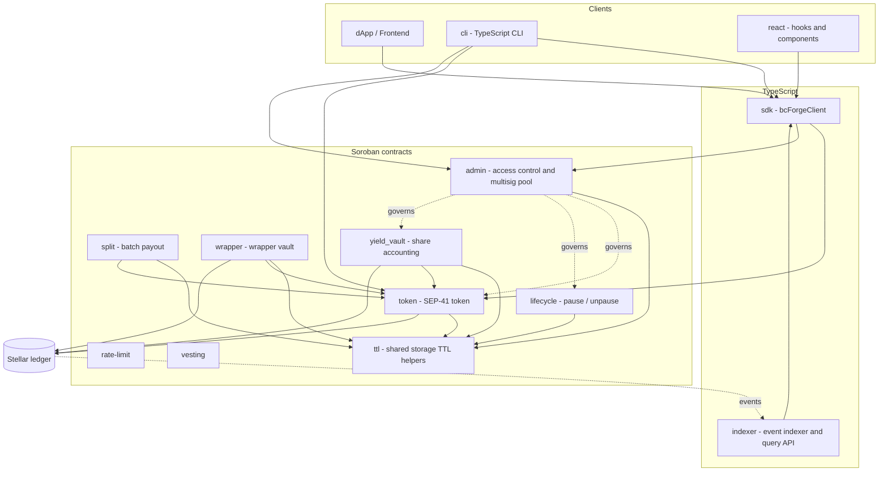

# bc-forge

A modular Soroban smart contract platform for **token minting** on the Stellar blockchain, with a TypeScript SDK for seamless integration.

Built for open-source collaboration via [drips.network](https://www.drips.network).

---

## Features

- **SEP-41 Compliant Token** — Full `TokenInterface` implementation (balance, transfer, approve, burn)
- **Admin-Controlled Minting** — Only the contract admin can mint new tokens
- **Pausable Lifecycle** — Emergency pause/unpause to halt all operations
- **Ownership Transfer** — Securely hand over admin rights
- **Total Supply Tracking** — Accurate supply updated on every mint/burn
- **TypeScript SDK** — High-level client for all contract interactions
- **Modular Architecture** — Separate crates for admin, lifecycle, and token logic
- **Reentrancy Protection** — Comprehensive reentrancy guards for all state-modifying functions
- **Rate Limiting** — Configurable global and per-address rate limits for mint and transfer operations
- **Batch Payout** — Per-recipient failure isolation in batch payments; failed transfers recorded for retry
- **Property-Based Fuzz Testing** — Enhanced proptest framework for invariant verification
- **End-to-End Integration Tests** — Complete lifecycle testing on Stellar testnet
- **Automatic Storage TTL Management** — Shared helper module extends Soroban contract and persistent storage TTL across calls

## Project Structure

```
bc-forge/
├── contracts/                     # Soroban smart contracts (Rust)
│   ├── admin/                     # Admin access control, proposals, multisig pool
│   ├── lifecycle/                 # Pause/unpause lifecycle module
│   ├── rate-limit/                # Rate limiting module
│   ├── split/                     # Batch payout with per-recipient failure isolation
│   ├── token/                     # Core SEP-41 token contract
│   ├── ttl/                       # Shared storage TTL helpers
│   ├── vesting/                   # Vesting schedules
│   ├── wrapper/                   # Wrapper vault
│   └── yield_vault/               # Yield-bearing vault with share accounting
├── cli/                           # TypeScript CLI (deploy, upgrade, multisig flows)
├── sdk/                           # TypeScript SDK consumed by dApps and the CLI
├── react/                         # React hooks and components for the SDK
├── indexer/                       # Event indexer and query API
├── e2e/                           # End-to-end integration tests
├── docs/                          # Long-form docs (architecture, vaults, upgrades)
├── deployments/                   # Recorded deployment addresses per network
├── migrations/                    # Database migrations for the indexer
├── scripts/                       # Repo maintenance and CI helper scripts
├── .github/
│   ├── ISSUE_TEMPLATE/            # Bug, Feature, Contract Improvement
│   ├── PULL_REQUEST_TEMPLATE.md
│   └── workflows/ci.yml           # CI pipeline
├── Cargo.toml                     # Rust workspace manifest
├── package.json                   # Root Node workspace manifest
├── config.example.json            # Example CLI/indexer configuration
├── CONTRIBUTING.md                # Contributor guide (drips.network)
├── SECURITY.md                    # Security policy and disclosure
├── VAULTS.md                      # Vault integration guide
├── LICENSE                        # MIT
└── README.md                      # This file
```

> `contracts/compound_fees` and `contracts/flash_loan_guard` are listed in the
> `exclude` array of the root `Cargo.toml`. They are not part of the built
> workspace and are not shipped; treat them as experimental.

### Architecture



The contracts share the `ttl` helper crate so that instance and persistent
storage entries stay live. `admin` holds the multisig pool that governs
upgrades and privileged operations on the value-bearing contracts.


## Storage TTL Strategy

To keep Soroban contract state active, bc-forge now includes shared TTL logic that:

- extends the contract instance TTL on every public token, admin, and lifecycle call
- refreshes persistent storage TTL for balances, allowances, lockups, roles, and proposals
- treats expired balances and allowances as zero instead of panicking

This makes the system more resilient to Soroban storage expiry while preserving on-chain security semantics.

## Prerequisites

| Tool | Version | Install |
|------|---------|---------|
| **Rust** | 1.74+ | [rustup.rs](https://rustup.rs) |
| **Wasm target** | — | `rustup target add wasm32-unknown-unknown` |
| **Stellar CLI** | 22.0+ | `cargo install stellar-cli --locked` |
| **Node.js** | 18+ | [nodejs.org](https://nodejs.org) |

## Local Setup

### 1. Clone the Repository

```bash
git clone https://github.com/BCPathway/bc-forge.git
cd bc-forge
```

### 2. Install Rust & Soroban Tooling

```bash
# Install Rust (if not already installed)
curl --proto '=https' --tlsv1.2 -sSf https://sh.rustup.rs | sh

# Add the WebAssembly target
rustup target add wasm32-unknown-unknown

# Install Stellar CLI (includes Soroban)
cargo install stellar-cli --locked
```

### 3. Build the Smart Contracts

```bash
# Build all contracts (debug)
cargo build

# Build optimized WASM for deployment
cargo build --target wasm32-unknown-unknown --release

# Or use Stellar CLI
stellar contract build
```

### 4. Run Contract Tests

```bash
cargo test --tests
```

Expected output:
```
running 5 tests (admin)     ... ok
running 5 tests (lifecycle) ... ok
running 16 tests (token)    ... ok
```

### 5. Setup the TypeScript SDK

```bash
cd sdk
npm install
npm run build
```

## CLI Deployment Configuration

The CLI reads `.bc-forge.json` from the current working directory. Start with the ready-to-use [`config.example.json`](config.example.json):

```bash
cp config.example.json .bc-forge.json
```

You can also generate a minimal file with `bc-forge config init`. The example contains these fields:

| Field | Required | Description |
|-------|----------|-------------|
| `version` | No | Configuration schema version. Defaults to `1.0.0`. |
| `name` | Yes | Token or project name. |
| `symbol` | Yes | Token symbol. |
| `decimals` | No | Token decimal precision, from 0 to 18. Defaults to `7`. |
| `admin` | No | Stellar public `G...` address that administers the token. Required when initializing a contract. |
| `superAdmin` | No | Stellar public `G...` address assigned the initial `SuperAdmin` role during RBAC initialization. Defaults to `admin` when omitted. |
| `network` | No | Deployment environment: `mainnet`, `testnet`, `futurenet`, `standalone`, or `custom`. Defaults to `testnet`. |
| `rpcUrl` | No | Soroban RPC endpoint URL. |
| `networkPassphrase` | No | Stellar network passphrase. |
| `secretKey` | No | Stellar `S...` secret key used to sign transactions. Prefer `SECRET_KEY` or another secret manager. |
| `contracts` | No | Map of deployed contract metadata keyed by contract name. |
| `contracts.<name>.contractId` | No | Deployed Soroban contract ID. |
| `contracts.<name>.wasmHash` | No | Hash of the deployed contract WASM. |
| `contracts.<name>.deployer` | No | Stellar public address that deployed the contract. |

Environment variables take precedence over file and local-store values for `RPC_URL`, `NETWORK_PASSPHRASE`, `CONTRACT_ID`, and `SECRET_KEY`. Replace every placeholder before deploying, and do not commit real secret keys.

## Deploy to Testnet

### Generate a Keypair

```bash
stellar keys generate --global deployer --network testnet
```

### Fund the Account

```bash
stellar keys fund deployer --network testnet
```

### Deploy the Token Contract

```bash
stellar contract deploy \
  --wasm target/wasm32-unknown-unknown/release/bc_forge_token.wasm \
  --source deployer \
  --network testnet
```

Save the returned **Contract ID** (e.g., `CABC...XYZ`).

### Initialize the Token

```bash
stellar contract invoke \
  --id <CONTRACT_ID> \
  --source deployer \
  --network testnet \
  -- \
  initialize \
  --admin <YOUR_PUBLIC_KEY> \
  --decimal 7 \
  --name "bc-forge Token" \
  --symbol "SFG"
```

### Initialize RBAC (Assign Initial SuperAdmin)

After initialization, run the `init_rbac` step to bootstrap role-based access
control and assign the initial `SuperAdmin` role:

```bash
# Bootstrap the SuperAdmin mapping from the configured admin (idempotent)
stellar contract invoke \
  --id <CONTRACT_ID> \
  --source deployer \
  --network testnet \
  -- \
  migrate_admin

# Assign the initial SuperAdmin role (the contract admin can perform this grant)
stellar contract invoke \
  --id <CONTRACT_ID> \
  --source deployer \
  --network testnet \
  -- \
  grant_role \
  --caller <YOUR_PUBLIC_KEY> \
  --role SuperAdmin \
  --address <SUPER_ADMIN_PUBLIC_KEY>

# Verify the assignment
stellar contract invoke \
  --id <CONTRACT_ID> \
  --network testnet \
  -- \
  has_role \
  --role SuperAdmin \
  --address <SUPER_ADMIN_PUBLIC_KEY>
```

### Mint Tokens

```bash
stellar contract invoke \
  --id <CONTRACT_ID> \
  --source deployer \
  --network testnet \
  -- \
  mint \
  --to <RECIPIENT_ADDRESS> \
  --amount 10000000000
```

### Check Balance

```bash
stellar contract invoke \
  --id <CONTRACT_ID> \
  --network testnet \
  -- \
  balance \
  --id <ADDRESS>
```

## Local Development with Quickstart

If you want to build and test against a local Soroban network, run the Stellar Quickstart container instead of using public testnet services.

### Start Quickstart

```bash
docker run -d \
  -p "8000:8000" \
  --name stellar \
  stellar/quickstart \
  --local
```

This starts a local Stellar network with RPC, Horizon, and Friendbot on your machine.

### Configure the CLI for the Local Network

Register the local network once, then switch the CLI to it:

```bash
stellar network add local \
  --rpc-url http://localhost:8000/rpc \
  --network-passphrase "Test SDF Network ; September 2015"

stellar network use local
```

### Generate and Fund Accounts

Create a local identity and fund it from the local Friendbot instance:

```bash
stellar keys generate deployer
stellar keys fund deployer
```

You can use `stellar keys public-key deployer` to print the address, then use that keypair as the source account for contract deploy and invoke commands on the local network.

### Point the TypeScript SDK at Quickstart

When using `bcForgeClient`, point `rpcUrl` at the local Quickstart instance:

```typescript
import { bcForgeClient } from '@bc-forge/sdk';

const client = new bcForgeClient({
  rpcUrl: 'http://localhost:8000',
  networkPassphrase: 'Test SDF Network ; September 2015',
  contractId: 'CABC...XYZ',
});
```

If your local Quickstart setup exposes RPC on a different path, keep the same host and update the URL to match your container configuration.

## SDK Usage

```typescript
import { bcForgeClient } from '@bc-forge/sdk';
import { Keypair } from '@stellar/stellar-sdk';

const client = new bcForgeClient({
  rpcUrl: 'https://soroban-testnet.stellar.org',
  networkPassphrase: 'Test SDF Network ; September 2015',
  contractId: 'CABC...XYZ',
});

// Query balance
const balance = await client.getBalance('GABC...DEF');
console.log('Balance:', balance.toString());

// Mint tokens (admin only)
const admin = Keypair.fromSecret('SXXX...');
await client.mint('GABC...DEF', BigInt(1000_0000000), admin);

// Transfer tokens
const sender = Keypair.fromSecret('SYYY...');
await client.transfer(
  sender.publicKey(),
  'GXYZ...ABC',
  BigInt(100_0000000),
  sender
);
```

See [sdk/README.md](sdk/README.md) for the full API reference.

## Smart Contract Architecture

See the [access-control diagrams](docs/ACCESS_CONTROL.md) for the current role
hierarchy, authorization sequence, protected operations, and governance flow.
See the [Vault Integration Guide](docs/VAULTS.md) for details on yield-bearing fee vaults, APY calculations, and frontend dApp integration.

```
┌─────────────────────────────────────────────────┐
│                  BcForgeToken                   │
│  ┌───────────┐  ┌──────────────┐  ┌───────────┐│
│  │   Admin    │  │  Lifecycle   │  │  SEP-41   ││
│  │  Module    │  │   Module     │  │ Interface ││
│  │           │  │              │  │           ││
│  │ set_admin │  │ pause()      │  │ balance() ││
│  │ get_admin │  │ unpause()    │  │ transfer()││
│  │ require_  │  │ is_paused()  │  │ approve() ││
│  │   admin() │  │ require_not_ │  │ burn()    ││
│  │           │  │   paused()   │  │ mint()    ││
│  └───────────┘  └──────────────┘  └───────────┘│
│  ┌──────────────────────────────────────────┐   │
│  │             Split Module                 │   │
│  │  ┌────────────────────────────────────┐  │   │
│  │  │ release_payment(invoice_id)        │  │   │
│  │  │   └─ try_transfer(recipient, amt) │  │   │
│  │  │ retry_failed_payout(invoice_id,   │  │   │
│  │  │   recipient)                      │  │   │
│  │  │ get_failed_payout / get_invoice   │  │   │
│  │  └────────────────────────────────────┘  │   │
│  └──────────────────────────────────────────┘   │
└─────────────────────────────────────────────────┘
```

## Community & first contribution

New here? Follow the [contributor walkthrough](docs/WALKTHROUGH.md) for a
start-to-finish example of setting up the repository, making a small change,
running checks, and opening a pull request.

The project does not currently publish verified Discord or Telegram invite URLs
in the repository. Maintainers can enable the badges below after adding the
official invites; contributors should not invent or copy unverified invite
links.

<!--
[](MAINTAINER_DISCORD_INVITE_URL)
[](MAINTAINER_TELEGRAM_INVITE_URL)
-->

## Contributing

We welcome contributions! bc-forge is maintained on [drips.network](https://www.drips.network) — contributors can earn rewards by resolving posted issues.

### Quick Start for Contributors

1. **Browse open issues** — Look for issues labeled `good-first-issue`, `smart-contract`, or `sdk`
2. **Fork & branch** — Create a branch: `feature/<issue-number>-<short-description>`
3. **Implement & test** — Write code, add/update tests, ensure `cargo test` and `npm run build` pass
4. **Submit a PR** — Use the PR template; reference the issue number

See [CONTRIBUTING.md](CONTRIBUTING.md) for the full guide.

### Branch Naming Convention

```
feature/<issue-number>-<description>     # New features
fix/<issue-number>-<description>         # Bug fixes
docs/<issue-number>-<description>        # Documentation
test/<issue-number>-<description>        # Test improvements
```

## Experimental contracts

The following contracts are experimental, untested, or incomplete. **Do not deploy them in a production environment.**

- `contracts/yield_vault`: A yield vault that holds or routes token balances. High risk if deployed with unchecked sources.
- `contracts/compound_fees`: A fee-compounding vault placeholder with no implementation yet. Excluded from the Cargo workspace, so it is not built or tested in CI.
- `contracts/flash_loan_guard`: A same-ledger deposit/withdraw guard. Excluded from the Cargo workspace, so it is not built or tested in CI.

## Security

Security is our top priority. If you discover a security vulnerability in bc-forge, please report it responsibly following our [Security Policy](SECURITY.md).

**Important**: Do not report security vulnerabilities through GitHub issues, discussions, or other public channels. All security reports must be made privately to **isaacsamson88@gmail.com**.

For more details about our vulnerability disclosure process, supported versions, scope, and response timeline, please review the [SECURITY.md](SECURITY.md) file.

How security reports are rewarded, and whether a hosted bounty program is live, is tracked in [docs/BUG_BOUNTY.md](docs/BUG_BOUNTY.md).

## License

[MIT](LICENSE) — Free for personal and commercial use.

## Links

- [Soroban Documentation](https://soroban.stellar.org/docs)
- [Stellar SDK (JS)](https://github.com/stellar/js-stellar-sdk)
- [SEP-41 Token Standard](https://github.com/stellar/stellar-protocol/blob/master/ecosystem/sep-0041.md)
- [drips.network](https://www.drips.network)
