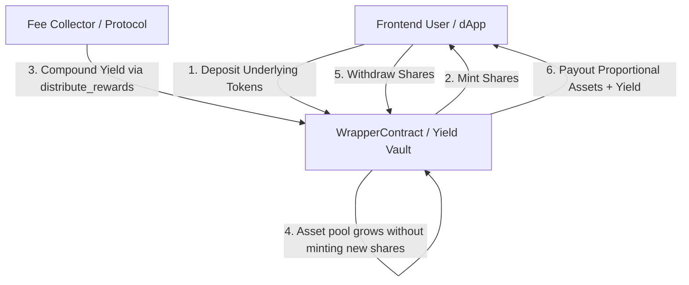
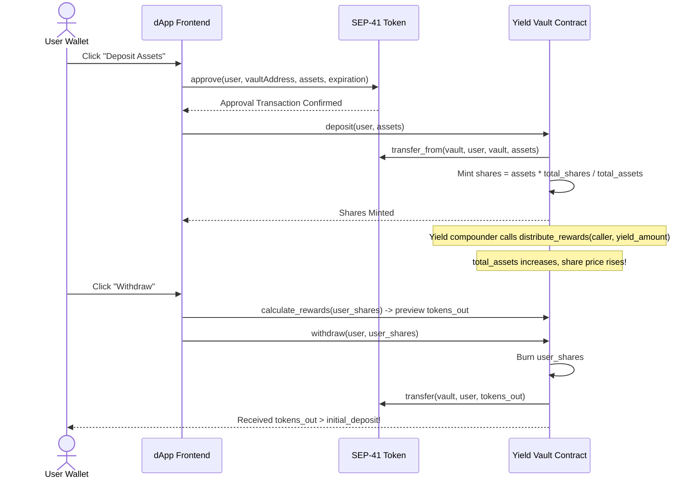

# Vault Integration Guide

This guide provides frontend developers and integrators with a complete overview of **Yield-Bearing Fee Vaults** in `bc-forge`. It details the smart contract mechanics, how to query vault yields, how to calculate Annual Percentage Yield (APY), and how to implement deposit and withdrawal workflows using Soroban and `@bc-forge/sdk`.

---

## 1. System Overview & Architecture

`bc-forge` Yield-Bearing Fee Vaults allow users to deposit SEP-41 compliant tokens into a yield-generating vault in exchange for pro-rata vault shares.



### Core Concepts

1. **Assets vs. Shares**:
   - **Assets** (`total_assets`): The balance of the underlying SEP-41 token held inside the vault contract.
   - **Shares** (`supply`): The total quantity of vault tokens minted to depositors.

2. **Exchange Rate Dynamics**:
   $$\text{Share Price} = \frac{\text{Total Assets}}{\text{Total Shares}}$$
   - **First Deposit**: Bootstraps the vault at a 1:1 exchange rate ($\text{shares} = \text{assets}$).
   - **Yield Accrual**: When protocol fees or rewards are injected into the vault via `distribute_rewards`, `total_assets` increases while `supply` remains constant. This increases the exchange rate ($\text{Share Price} > 1$).

3. **Pro-Rata Withdrawal Payouts**:
   - When a user burns shares to withdraw, their asset entitlement is calculated as:
     $$\text{tokens\_out} = \lfloor \frac{\text{shares} \times \text{total\_assets}}{\text{total\_shares}} \rfloor$$
   - Because yield increases `total_assets`, withdrawing returns **more tokens than the original deposit** ($\text{tokens\_out} > \text{initial\_deposit}$).

---

## 2. Smart Contract Methods Reference

The vault logic is implemented in `WrapperContract` (`contracts/wrapper/src/lib.rs`) and `YieldVaultContract` (`contracts/yield_vault/src/lib.rs`).

| Method | Type | Description |
| --- | --- | --- |
| `deposit(env, caller, assets)` | Write | Deposits `assets` of underlying token and mints proportional shares based on current exchange rate. |
| `withdraw(env, caller, shares)` | Write | Burns `shares` and transfers proportional underlying tokens (principal + yield) back to `caller`. |
| `wrap(env, caller, amount)` | Write | Mints wrapped tokens 1:1 with underlying tokens (flat scaling). |
| `unwrap(env, caller, amount)` | Write | Burns wrapped tokens 1:1 for underlying tokens. |
| `distribute_rewards(env, caller, amount)` | Write | Injects yield/fee tokens into the vault without minting new shares, increasing the share price. |
| `total_assets(env)` | Read | Returns the total underlying asset balance owned by the vault contract. |
| `supply(env)` | Read | Returns the total number of outstanding vault shares. |
| `calculate_share_price(env)` | Read | Returns integer floor share price ($\text{total\_assets} / \text{total\_shares}$). |
| `calculate_rewards(env, user_shares)` | Read | Returns exact pro-rata payout preview for `user_shares` without executing a transaction. |
| `share_balance(env, user)` | Read | Returns the vault share balance held by `user`. |
| `pending_rewards(env)` | Read | Returns cumulative undistributed rewards. |
| `get_unlock_time(env, user)` | Read | Returns unix timestamp at which `user`'s deposit becomes withdrawable (if time-locked). |

---

## 3. Querying Vault Yields & APY with `@bc-forge/sdk`

The `@bc-forge/sdk` package provides a high-level `calculateApy()` function that simulates contract state across historical ledger snapshots to calculate annualised returns without spending network fees.

### TypeScript SDK Example

```typescript
import { calculateApy, ApyResult } from '@bc-forge/sdk';
import { Networks } from '@stellar/stellar-sdk';

async function fetchVaultMetrics(contractId: string) {
  const options = {
    rpcUrl: 'https://soroban-testnet.stellar.org',
    networkPassphrase: Networks.TESTNET,
    contractId,
    lookbackLedgers: 17280, // ~24 hours lookback window (17,280 ledgers @ 5s/ledger)
  };

  const result: ApyResult | null = await calculateApy(options);

  if (!result) {
    console.log('Vault has no outstanding shares or insufficient historical data.');
    return;
  }

  const apyPercentage = (result.apy * 100).toFixed(2);
  console.log(`Current Vault APY: ${apyPercentage}%`);
  console.log(`Current Share Price: ${result.current.sharePrice}`);
  console.log(`Historical Share Price (24h ago): ${result.historical.sharePrice}`);
  console.log(`Measurement Window: ${result.windowDays.toFixed(2)} days (${result.windowLedgers} ledgers)`);
}
```

---

## 4. Custom Querying & APY Calculation Logic

If your frontend dApp performs custom RPC calls using `@stellar/stellar-sdk`, follow this mathematical formulation:

### Mathematical APY Formula

1. **Calculate Historical and Current Share Prices**:
   $$\text{SharePrice} = \frac{\text{total\_assets}}{\text{total\_shares}}$$

2. **Compute Growth Rate**:
   $$\text{Growth} = \frac{\text{SharePrice}_{\text{current}} - \text{SharePrice}_{\text{historical}}}{\text{SharePrice}_{\text{historical}}}$$

3. **Annualise the Yield**:
   $$\text{Periods} = \frac{\text{LEDGERS\_PER\_YEAR}}{\Delta\text{Ledgers}}$$
   $$\text{APY} = (1 + \text{Growth})^{\text{Periods}} - 1$$

   *Note: On Stellar, $\text{LEDGERS\_PER\_YEAR} \approx \frac{365.25 \times 86400}{5} = 6,311,520$ ledgers.*

### Frontend Implementation Snippet

```typescript
import { rpc as SorobanRpc, Contract, TransactionBuilder, Account, xdr } from '@stellar/stellar-sdk';

const LEDGER_CLOSE_TIME_S = 5;
const LEDGERS_PER_YEAR = (365.25 * 86400) / LEDGER_CLOSE_TIME_S; // 6,311,520

export async function computeCustomApy(
  rpcUrl: string,
  networkPassphrase: string,
  vaultContractId: string,
  lookbackLedgers = 17280
) {
  const server = new SorobanRpc.Server(rpcUrl);
  const contract = new Contract(vaultContractId);
  const { sequence: latestLedger } = await server.getLatestLedger();
  const historicalLedger = Math.max(1, latestLedger - lookbackLedgers);

  // Read snapshots
  const [currentSnapshot, historicalSnapshot] = await Promise.all([
    readVaultSnapshot(server, networkPassphrase, contract, latestLedger),
    readVaultSnapshot(server, networkPassphrase, contract, historicalLedger),
  ]);

  if (!currentSnapshot.sharePrice || !historicalSnapshot.sharePrice) {
    return null;
  }

  const windowLedgers = latestLedger - historicalLedger;
  const growth = (currentSnapshot.sharePrice - historicalSnapshot.sharePrice) / historicalSnapshot.sharePrice;
  const periods = LEDGERS_PER_YEAR / windowLedgers;
  const apy = Math.pow(1 + growth, periods) - 1;

  return {
    apy,
    apyPercent: (apy * 100).toFixed(2),
    currentSharePrice: currentSnapshot.sharePrice,
    historicalSharePrice: historicalSnapshot.sharePrice,
  };
}

async function readVaultSnapshot(
  server: SorobanRpc.Server,
  networkPassphrase: string,
  contract: Contract,
  ledger?: number
) {
  // Simulate total_assets and supply calls via read-only transactions
  const totalAssets = await simulateI128Call(server, networkPassphrase, contract, 'total_assets', ledger);
  const totalShares = await simulateI128Call(server, networkPassphrase, contract, 'supply', ledger);

  const assets = totalAssets ?? 0n;
  const shares = totalShares ?? 0n;
  const sharePrice = shares > 0n ? Number(assets) / Number(shares) : null;

  return { ledger, totalAssets: assets, totalShares: shares, sharePrice };
}

async function simulateI128Call(
  server: SorobanRpc.Server,
  networkPassphrase: string,
  contract: Contract,
  method: string,
  ledger?: number
): Promise<bigint | null> {
  const dummyAccount = new Account('GAAAAAAAAAAAAAAAAAAAAAAAAAAAAAAAAAAAAAAAAAAAAAAAAAAAAWHF', '0');
  const tx = new TransactionBuilder(dummyAccount, { fee: '100', networkPassphrase })
    .addOperation(contract.call(method))
    .setTimeout(30)
    .build();

  const simResponse: any = ledger
    ? await (server as any).simulateTransaction(tx, ledger)
    : await server.simulateTransaction(tx);

  if (!simResponse.result) return null;
  const retval = simResponse.result.retval;
  const i128 = retval.i128 ? retval.i128() : undefined;
  if (i128) {
    const hi = BigInt(i128.hi().toString());
    const lo = BigInt(i128.lo().toString());
    return (hi << 64n) | lo;
  }
  return null;
}
```

---

## 5. Deposit and Withdrawal Workflow

### Step-by-Step Frontend Workflow



### 1. Token Approval & Deposit Code Example

```typescript
// Approve vault to spend user's underlying SEP-41 tokens
await underlyingTokenContract.approve({
  from: userAddress,
  spender: vaultContractAddress,
  amount: depositAmount,
  expiration: ledgerSequence + 1000,
});

// Deposit into vault to receive shares
const sharesMinted = await vaultContract.deposit({
  caller: userAddress,
  assets: depositAmount,
});
console.log(`Deposited ${depositAmount} tokens, received ${sharesMinted} vault shares.`);
```

### 2. Previewing Entitlement & Executing Withdrawal

```typescript
// Preview expected token return prior to withdrawal
const expectedTokensOut = await vaultContract.calculate_rewards({
  user_shares: userShareBalance,
});
console.log(`Expected payout on redemption: ${expectedTokensOut} underlying tokens.`);

// Execute withdrawal
const tokensReturned = await vaultContract.withdraw({
  caller: userAddress,
  shares: userShareBalance,
});

console.log(`Withdrawal complete. Tokens returned: ${tokensReturned}`);
if (tokensReturned > depositAmount) {
  console.log(`Yield earned: ${tokensReturned - depositAmount} tokens!`);
}
```

---

## 6. Error Codes & Exception Handling

When interacting with vault methods, the contract may return the following `WrapperError` codes:

| Code | Name | Cause | Resolution / Handling |
| --- | --- | --- | --- |
| `1` | `AlreadyInitialized` | Re-initialization attempt. | Verify contract setup state. |
| `2` | `NotInitialized` | Interacting before contract initialization. | Ensure `initialize()` has executed. |
| `3` | `InvalidAmount` | Zero, negative, or calculation overflow/rounding-down. | Ensure amounts > 0 and sufficient share precision. |
| `4` | `InsufficientBalance` | Attempting to withdraw or transfer more shares than owned. | Check user share balance before transaction. |
| `5` | `InsufficientAllowance` | Missing token approval for deposit/wrap. | Call `approve()` on underlying token contract first. |
| `6` | `ContractPaused` | Vault operations paused by admin/pauser. | Notify user that vault operations are temporarily paused. |
| `7` | `Reentrant` | Reentrancy attempt detected. | Prevent duplicate state-changing calls. |
| `8` | `UnderlyingCallFailed` | Cross-contract transfer failed. | Check underlying token balance or transfer restrictions. |
| `11` | `TokensLocked` | Deposit is time-locked until unlock timestamp. | Check `get_unlock_time(user)` and prompt user to wait. |
| `12` | `ZeroShares` | `calculate_share_price` called with no outstanding shares. | Handle empty vault state gracefully in frontend UI. |
