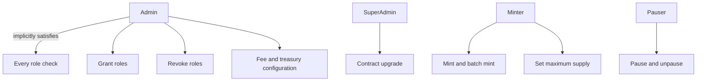
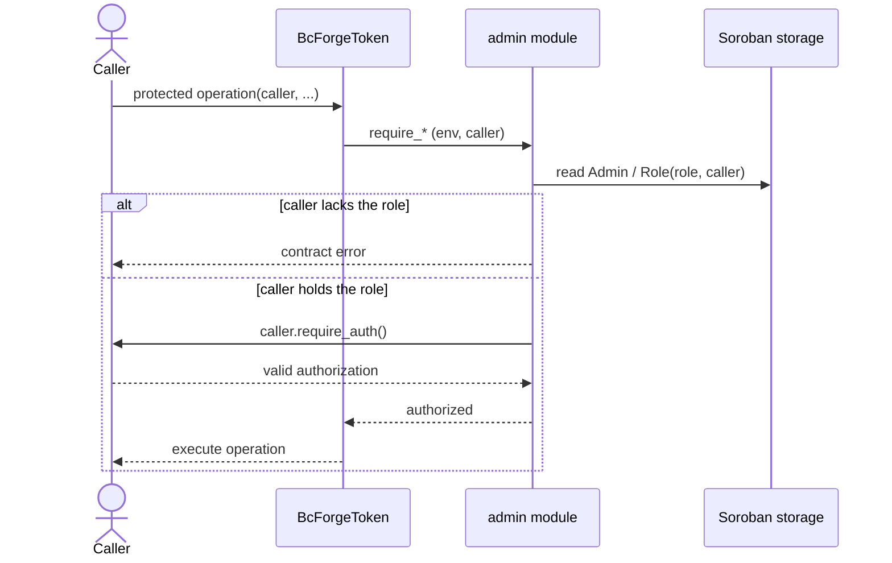
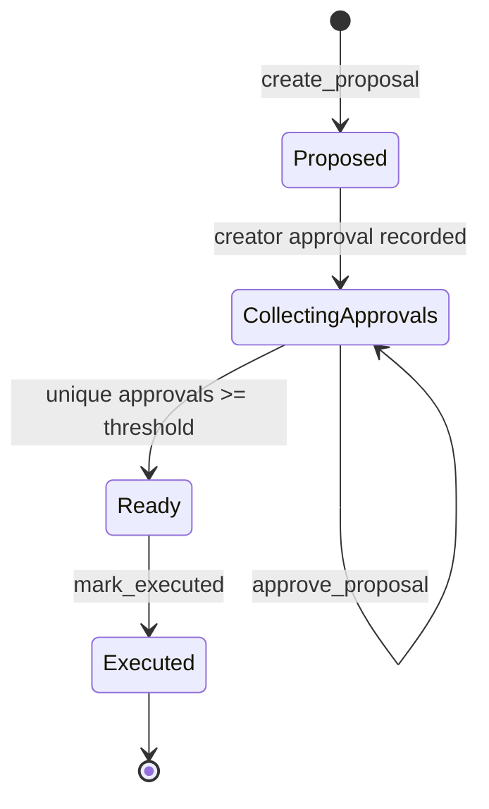

# Access control

bc-forge uses role-based access control from `contracts/admin`. Every protected
operation first checks that the supplied caller holds the required role and then
calls Soroban's `Address::require_auth`. Holding a role is therefore not enough:
the role holder must also authorize the transaction.

## Role hierarchy

`Admin` is a role superset: `has_role` treats the configured admin as holding
every role. Explicit `Minter`, `SuperAdmin`, and `Pauser` assignments grant only
their named privilege. Fee administration currently uses the `Admin` role.

## Authorization flow

The zero-address sentinel is rejected before role assignment or authorization.
Role membership is stored persistently under `AdminKey::Role(Role, Address)`;
the singular admin, governance pool, threshold, and proposals use instance
storage.

## Protected operations

| Operation | Required authority | Guard |
| --- | --- | --- |
| `mint`, `batch_mint` | Minter or Admin | `require_minter` |
| `set_max_supply` | Minter or Admin | `require_minter` |
| `upgrade` | SuperAdmin or Admin | `require_super_admin` |
| `pause`, `unpause` | Configured Admin | lifecycle `require_auth` |
| `set_fee_config`, `set_treasury` | Admin | `require_fee_admin` |
| `set_fee_exemption`, `remove_fee_exemption` | Admin | `require_fee_admin` |
| `grant_role` | SuperAdmin or Admin | `require_super_admin` |
| `revoke_role` | Configured Admin | `admin.require_auth` |
| `set_admin_pool` | Configured Admin | `admin.require_auth` |
| proposal approval/execution | Admin-pool member and threshold | membership and approval checks |

## Governance proposals

Duplicate approvals and execution before the configured threshold are rejected.
Once marked executed, a proposal cannot be executed again.

## Source of truth

- Role definitions and guards:
  [`contracts/admin/src/lib.rs`](../contracts/admin/src/lib.rs)
- Token entrypoints and their guards:
  [`contracts/token/src/lib.rs`](../contracts/token/src/lib.rs)
- Pause state and authorization:
  [`contracts/lifecycle/src/lib.rs`](../contracts/lifecycle/src/lib.rs)

When a protected entrypoint changes, update the operation table and relevant
diagram in the same pull request.
