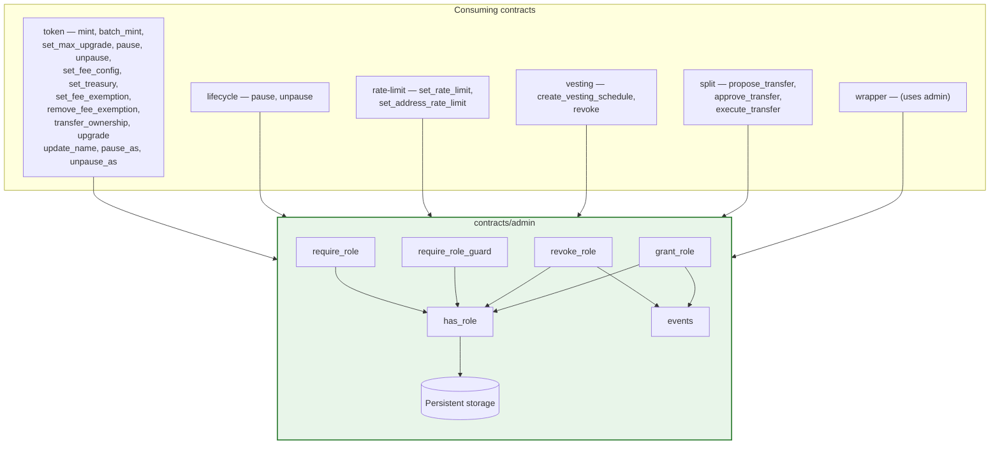
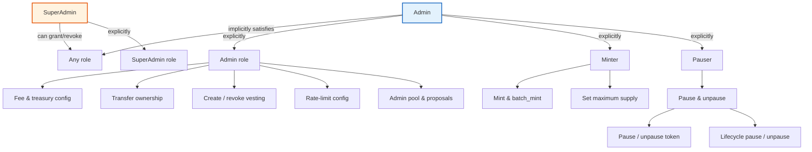
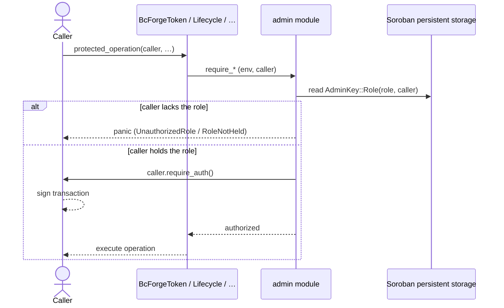
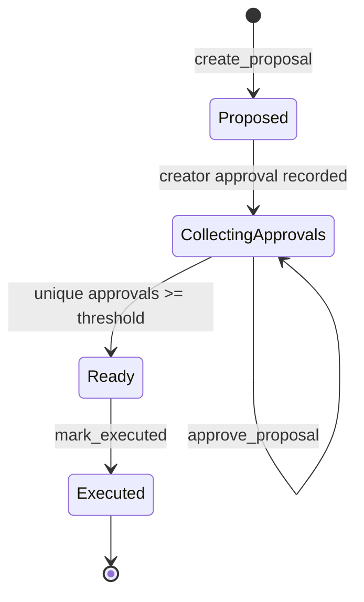

# Access Control

bc-forge uses role-based access control (RBAC) implemented in `contracts/admin`.
Every protected operation checks that the caller holds the required role and then
calls Soroban's `Address::require_auth`. Holding a role is not enough — the role
holder must also authorize the transaction.

## System architecture

The admin module is the single authority consumed by every contract in the
workspace. The diagram below shows the dependency graph and which guard each
contract invokes.



## Role hierarchy



`Admin` is a role superset: `has_role` treats the configured admin as holding
every role. Explicit `Minter`, `SuperAdmin`, and `Pauser` assignments grant only
their named privilege.

## Authorization flow



The zero-address sentinel (`GAAAA…WHF`) is rejected before role assignment or
authorization. The admin module does **not** implement reentrancy guards —
wrappers around multi-step flows (e.g. create → approve → execute proposal)
should protect those at a higher level.

## Storage layout

All state is stored under the `AdminKey` enum. Each variant maps to a unique
storage slot, domain-separated by Soroban's storage API.

| Variant | Domain | Value type | Description |
| --- | --- | --- | --- |
| `Admin` | `instance()` | `Address` | Singular contract admin |
| `Role(Role, Address)` | `persistent()` | `bool` | Role membership flag |
| `AdminPool` | `instance()` | `Vec<Address>` | Multi-sig admin pool |
| `Threshold` | `instance()` | `u32` | Approvals required for proposal |
| `Proposal(u64)` | `instance()` | `Proposal` | Governance proposal data |
| `ProposalIdCounter` | `instance()` | `u64` | Auto-incrementing proposal ID |
| `SuperAdmin(Address)` | `persistent()` | `bool` | Populated by `migrate_admin` |

`instance()` state lives on the contract instance ledger entry (shared TTL).
`persistent()` state is per-key with independent TTL, extended on every
grant/admin-set.

## Protected operations

The table below lists every RBAC-guarded entrypoint across the workspace.

### Token contract (`contracts/token`)

| Operation | Required authority | Guard |
| --- | --- | --- |
| `mint` | Minter or Admin | `require_minter` |
| `batch_mint` | Minter or Admin | `require_minter` |
| `set_max_supply` | Minter or Admin | `require_minter` |
| `upgrade` | SuperAdmin or Admin | `require_super_admin` |
| `pause` | Admin or Pauser | `has_role(Pauser)` + `require_auth` |
| `unpause` | Admin or Pauser | `has_role(Pauser)` + `require_auth` |
| `pause_as` | Pauser (via lifecycle) | `require_role(Pauser)` |
| `unpause_as` | Pauser (via lifecycle) | `require_pauser` |
| `transfer_ownership` | Admin | `require_admin` |
| `set_fee_config` | Admin | `require_admin` |
| `set_treasury` | Admin | `require_admin` |
| `set_fee_exemption` | Admin | `require_admin` |
| `remove_fee_exemption` | Admin | `require_admin` |
| `update_name` | Admin | `require_admin` |

### Admin module (`contracts/admin`)

| Operation | Required authority | Guard |
| --- | --- | --- |
| `grant_role` | SuperAdmin or Admin | `require_super_admin` |
| `revoke_role` | SuperAdmin or Admin | `require_super_admin` |
| `set_admin_pool` | Admin | `admin.require_auth` |
| `create_proposal` | Admin-pool member | pool membership + `require_auth` |
| `approve_proposal` | Admin-pool member | pool membership + `require_auth` |
| `mark_executed` | Admin | `admin.require_auth` (threshold check) |

### Lifecycle module (`contracts/lifecycle`)

| Operation | Required authority | Guard |
| --- | --- | --- |
| `pause` | Pauser or Admin | `require_role(Pauser)` |
| `unpause` | Pauser or Admin | `require_pauser` |

### Rate-limit module (`contracts/rate-limit`)

| Operation | Required authority | Guard |
| --- | --- | --- |
| `set_rate_limit` | Admin | `require_role_guard(Admin)` |
| `set_address_rate_limit` | Admin | `require_role_guard(Admin)` |

### Vesting module (`contracts/vesting`)

| Operation | Required authority | Guard |
| --- | --- | --- |
| `create_vesting_schedule` | Admin | `require_admin` |
| `revoke` | Admin | `require_admin` |

### Split module (`contracts/split`)

| Operation | Required authority | Guard |
| --- | --- | --- |
| `propose_transfer` | SuperAdmin or Admin | `require_super_admin` |
| `approve_transfer` | SuperAdmin or Admin | `require_super_admin` |
| `execute_transfer` | SuperAdmin or Admin | `require_super_admin` |

## Governance proposals



- The creator is automatically the first approval.
- Duplicate approvals and execution before the threshold are rejected.
- Once marked executed, a proposal cannot be executed again.
- Threshold defaults to `1` if no pool is configured.
- `get_admin_pool` falls back to `[admin]` when no explicit pool exists.

## Error codes

| Code | Variant | Meaning |
| --- | --- | --- |
| 1 | `RoleNotGranted` | Unused — retained for ABI stability |
| 2 | `RoleNotHeld` | `revoke_role` / `require_role` when role is missing |
| 3 | `UnauthorizedRole` | `require_role_guard` failure (caller not authorized) |
| 4 | `InvalidAddress` | Operation attempted with the zero-address sentinel |
| 5 | `InvalidRole` | Unrecognized role discriminant supplied |
| 6 | `AlreadyInitialized` | `init_storage` called on an already-initialized contract |

## Events

| Topic | Emitted by | Data |
| --- | --- | --- |
| `role_grnt` | `set_admin`, `grant_role` | `(admin, role, address)` |
| `role_rvk` | `revoke_role` | `(admin, role, address)` |
| `role_chk` | `has_role` | `(address, role, result)` |

## TypeScript SDK integration

The SDK (`sdk/src/client.ts`) mirrors the contract roles:

```typescript
export enum Role {
  Admin = 'Admin',
  SuperAdmin = 'SuperAdmin',
  Minter = 'Minter',
  Pauser = 'Pauser',
}
```

SDK methods for RBAC:

| Method | Description |
| --- | --- |
| `grantMinter(address, source)` | Grant Minter role (calls `grant_role` on contract) |
| `revokeMinter(address, source)` | Revoke Minter role (calls `revoke_role` on contract) |

The `source` parameter must be a `Keypair` with the appropriate role. For
`grant_role`, the caller must hold `SuperAdmin`. The SDK serializes roles using
`nativeToScVal` for on-chain compatibility.

## Key invariants

- **Admin is a superset.** Any address holding `Admin` passes every role check.
- **Zero-address rejection.** `GAAAA…WHF` can never hold a role; all guards
  reject it before storage writes. Use [`is_zero_address`] and
  [`require_non_zero_address`] for validation in consuming contracts.
- **Storage slot isolation.** Each `AdminKey` variant uses a unique enum
  discriminant. Domain separation (`instance` vs `persistent`) provides an
  additional layer.
- **Authorization required.** Role membership alone is not sufficient — every
  guarded operation also calls `Address::require_auth`.
- **Idempotent proposals.** Duplicate approvals and double-execution are
  rejected at the contract level.

## Zero-address validation helpers

The admin module exports two public helpers for zero-address validation:

| Function | Signature | Description |
| --- | --- | --- |
| `is_zero_address` | `pub fn is_zero_address(env: &Env, address: &Address) -> bool` | Returns `true` if `address` is the zero-address sentinel |
| `require_non_zero_address` | `pub fn require_non_zero_address(env: &Env, address: &Address)` | Panics with `InvalidAddress` if `address` is the zero address |
| `ZERO_ADDRESS_STRKEY` | `pub const ZERO_ADDRESS_STRKEY: &str` | The Stellar zero address constant |

These are used throughout the admin module in:
- `set_admin` — rejects zero address before storing
- `grant_role` — rejects zero address before role assignment
- `_grant_role` — rejects zero address before storage write
- `revoke_role` — rejects zero address before role removal
- `_revoke_role` — rejects zero address before storage mutation
- `has_role` — short-circuits to `false` for zero address
- `set_admin_pool` — rejects zero addresses in the pool

### Usage in consuming contracts

```rust,ignore
use bc_forge_admin::{is_zero_address, require_non_zero_address};

// Check without panicking
if is_zero_address(env, &some_address) {
    // Handle the zero address case
}

// Guard before a storage write
require_non_zero_address(env, &new_address);
```

### TypeScript SDK

The SDK exports a client-side `isZeroAddress` helper:

```typescript
import { isZeroAddress, ZERO_ADDRESS } from '@bc-forge/sdk';

if (isZeroAddress(someAddress)) {
    throw new Error('Invalid address: zero address is not allowed');
}
```

## Source of truth

- Role definitions and guards:
  [`contracts/admin/src/lib.rs`](../contracts/admin/src/lib.rs)
- Event emission:
  [`contracts/admin/src/events.rs`](../contracts/admin/src/events.rs)
- Token entrypoints and guards:
  [`contracts/token/src/lib.rs`](../contracts/token/src/lib.rs)
- Pause state and lifecycle authorization:
  [`contracts/lifecycle/src/lib.rs`](../contracts/lifecycle/src/lib.rs)
- Rate-limit role gating:
  [`contracts/rate-limit/src/lib.rs`](../contracts/rate-limit/src/lib.rs)
- Vesting admin guards:
  [`contracts/vesting/src/lib.rs`](../contracts/vesting/src/lib.rs)
- Split SuperAdmin guards:
  [`contracts/split/src/lib.rs`](../contracts/split/src/lib.rs)
- SDK role definitions:
  [`sdk/src/client.ts`](../sdk/src/client.ts)

When a protected entrypoint changes, update the operation table and relevant
diagram in the same pull request.
