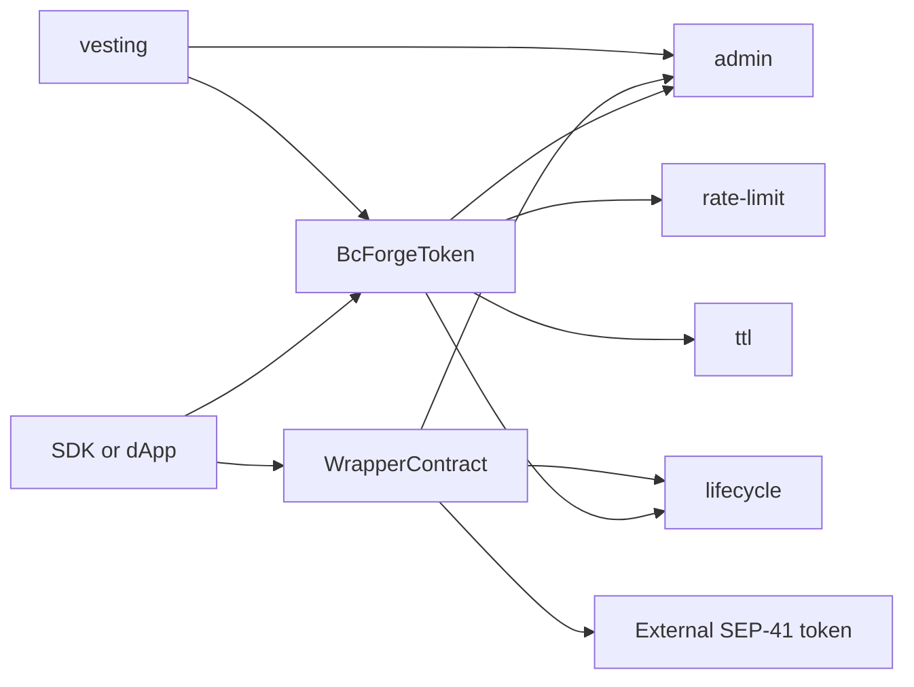
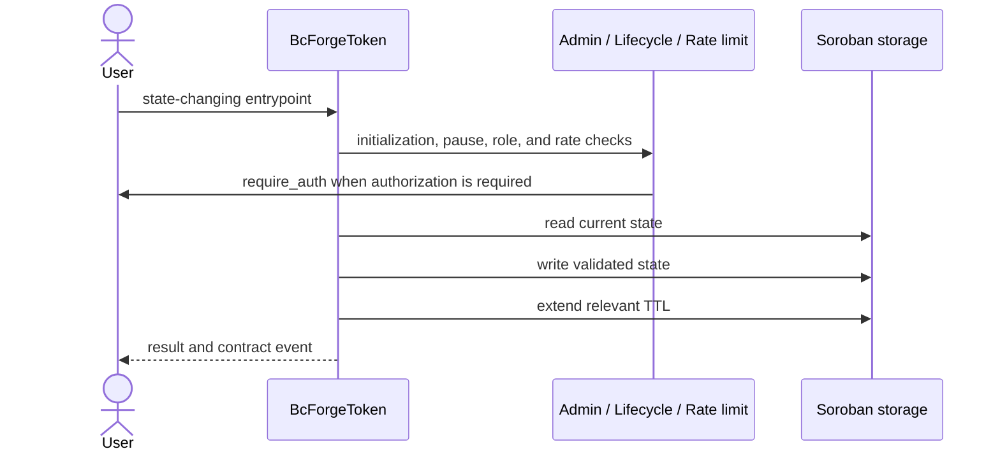
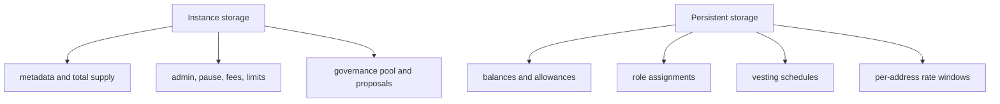

# Architecture specification

This document describes the current bc-forge contract workspace. It is a
maintainer-facing map of module boundaries, state ownership, and runtime call
flows; public ABI details remain documented by each crate's Rust API.

## System context

`BcForgeToken` and `WrapperContract` are deployable contracts. The admin,
lifecycle, rate-limit, and TTL crates are reusable policy modules linked into
deployable contracts. The vesting contract escrows tokens and releases them
according to schedules. The wrapper locks an external SEP-41 asset and mints a
matching wrapped balance.

## Workspace components

| Crate | Responsibility | Primary state |
| --- | --- | --- |
| `contracts/token` | SEP-41 balances, allowances, supply, minting, fees, and upgrades | supply, balances, allowances, metadata, fee configuration |
| `contracts/admin` | roles and multi-signature governance | admin, role assignments, admin pool, proposals |
| `contracts/lifecycle` | emergency pause state and guards | paused flag |
| `contracts/rate-limit` | transfer and mint limits | per-address rate windows |
| `contracts/ttl` | shared ledger-entry lifetime policy | constants and TTL helpers |
| `contracts/vesting` | time-based token release | vesting schedules and claimed amounts |
| `contracts/wrapper` | SEP-41 wrapping and unwrapping | underlying asset, wrapped balances, supply, allowances |
| `e2e` | cross-crate contract tests | test-only fixtures |

The root Cargo workspace includes every directory under `contracts/*` and uses
the contract crates as its default members.

## Token call path

Checks occur before balance or supply mutation. Operations that move a user's
funds require that user's authorization. Privileged operations additionally
pass through the appropriate role guard. Public token calls refresh instance
TTL, while address-scoped records refresh their persistent TTL when used.

## Storage model

- **Instance storage** owns contract-wide configuration and aggregates.
- **Persistent storage** owns independently expiring address- or schedule-scoped
  records.
- Storage keys are contract types. Existing enum variants must not be reordered
  because their encoded discriminants are part of the upgrade-compatible state
  layout.
- New state-changing paths must apply the shared TTL policy to every record they
  create or update.

## Wrapper invariants

For a wrapper with equal decimal precision, wrapped supply must equal the amount
of underlying tokens held by the wrapper. When precisions differ, wrap and
unwrap scale amounts deterministically. Both flows:

1. reject invalid amounts;
2. check pause and initialization state;
3. acquire the instance-storage reentrancy lock;
4. perform the underlying token transfer;
5. update wrapped supply and account balance; and
6. release the lock.

The wrapper implements SEP-41, so clients can treat the wrapped asset like any
other Stellar token after wrapping.

## Upgrade and security boundaries

- Contract WASM upgrades require `SuperAdmin` (the configured `Admin` implicitly
  satisfies every role).
- Minting requires `Minter`; emergency lifecycle operations are admin-authorized.
- Role checks always pair stored membership with `Address::require_auth`.
- Token and wrapper external-call paths use reentrancy locks.
- Arithmetic and input checks must complete before state mutation or external
  transfer wherever the flow permits.

Role definitions and governance details live in
[`contracts/admin/src/lib.rs`](../contracts/admin/src/lib.rs).

## Compatibility rules

Changes are upgrade-compatible only when they preserve:

- existing contract function names and parameter encodings;
- numeric contract error values;
- storage-key discriminants and stored value types;
- SEP-41 behavior for token and wrapper entrypoints; and
- event topic/data shapes consumed by indexers.

Any intentional compatibility break requires a migration plan and an explicit
release note.
