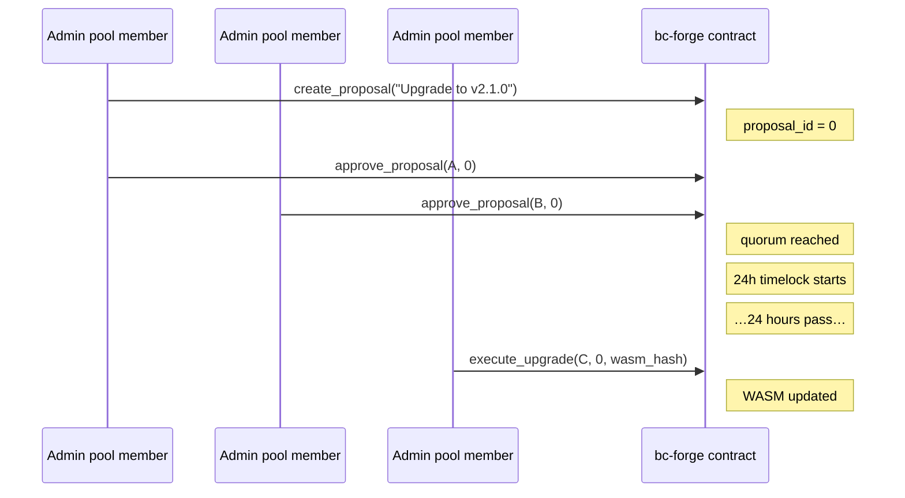

# Upgrade Guide

This guide covers how to perform network upgrades for bc-forge Soroban smart
contracts. There are two upgrade paths depending on your governance model.

## Prerequisites

| Tool | Version | Purpose |
| --- | --- | --- |
| Rust | stable | Build WASM artifacts |
| `wasm32-unknown-unknown` target | — | Compile to WASM |
| `soroban` CLI | latest | Deploy and invoke contracts |
| `@bc-forge/sdk` | latest | TypeScript upgrade helper |

Install the WASM target if you haven't already:

```bash
rustup target add wasm32-unknown-unknown
```

### Required roles

- **Direct upgrade:** `SuperAdmin` (the configured `Admin` implicitly satisfies
  every role).
- **Governance upgrade:** Admin-pool membership with quorum approval.

## Build the new WASM

```bash
cargo build --target wasm32-unknown-unknown --release -p bc-forge-token
```

The optimized artifact is written to
`target/wasm32-unknown-unknown/release/bc_forge_token.wasm`. Copy or hash it
for the upgrade transaction.

To build all workspace contracts at once:

```bash
cargo build --target wasm32-unknown-unknown --release
```

Artifacts are placed under `target/wasm32-unknown-unknown/release/`:

| Contract | WASM file |
| --- | --- |
| Token | `bc_forge_token.wasm` |
| Admin | `bc_forge_admin.wasm` |
| Lifecycle | `bc_forge_lifecycle.wasm` |
| Wrapper | `bc_forge_wrapper.wasm` |
| Vesting | `bc_forge_vesting.wasm` |
| Rate-limit | `bc_forge_rate_limit.wasm` |
| Split | `bc_forge_split.wasm` |

## Path 1 — Direct SuperAdmin upgrade

Use this path when a single `SuperAdmin` key is authorized to perform the
upgrade. This is the simplest approach for testnet or single-owner deployments.

### Via CLI

```bash
# Upload the new WASM and get its hash
stellar contract install \
  --wasm target/wasm32-unknown-unknown/release/bc_forge_token.wasm \
  --source $SUPER_ADMIN_SECRET \
  --network testnet
```

The command prints a 32-byte hash. Use it to invoke the `upgrade` entrypoint:

```bash
stellar contract invoke \
  --id <CONTRACT_ID> \
  --source $SUPER_ADMIN_SECRET \
  --network testnet \
  -- \
  upgrade \
  --upgrader <SUPER_ADMIN_PUBLIC_KEY> \
  --new_wasm_hash <WASM_HASH>
```

### Via SDK

```typescript
import { bcForgeClient } from '@bc-forge/sdk';
import { Keypair } from '@stellar/stellar-sdk';

const client = new bcForgeClient({
  rpcUrl: 'https://soroban-testnet.stellar.org',
  networkPassphrase: 'Test SDF Network ; September 2015',
  contractId: '<CONTRACT_ID>',
});

const adminKeypair = Keypair.fromSecret(process.env.SUPER_ADMIN_SECRET!);

// The WASM hash from `stellar contract install`
const newWasmHash = '<32_BYTE_HEX_HASH>';

const result = await client.upgrade(newWasmHash, adminKeypair);
console.log('Upgrade TX:', result.hash);
```

### Via deployment script

The wrapper deployment script in `deployments/` handles build, deploy, and
verify in one step:

```bash
# Bash
./deployments/deploy-wrapper-testnet.sh <ADMIN_SECRET_KEY>

# PowerShell
./deployments/deploy-wrapper-testnet.ps1 -AdminSeed "<ADMIN_SECRET_KEY>"
```

## Path 2 — Multi-sig governance upgrade

Use this path when the contract is governed by an admin pool with a quorum
threshold. This path enforces a 24-hour timelock between quorum and execution.

### Workflow



### Step 1 — Configure the admin pool

If not already configured, set up the multi-sig pool:

```bash
stellar contract invoke \
  --id <CONTRACT_ID> \
  --source $ADMIN_SECRET \
  --network testnet \
  -- \
  set_admin_pool \
  --pool '["GABC...","GDEF...","GHIJ..."]' \
  --threshold 2
```

Or via SDK:

```typescript
await client.setAdminPool(
  ['GABC...', 'GDEF...', 'GHIJ...'],
  2,  // quorum threshold
  adminKeypair,
);
```

### Step 2 — Create the upgrade proposal

Any pool member can create a proposal:

```bash
stellar contract invoke \
  --id <CONTRACT_ID> \
  --source $POOL_MEMBER_SECRET \
  --network testnet \
  -- \
  create_proposal \
  --creator <POOL_MEMBER_PUBLIC_KEY> \
  --description "Upgrade to v2.1.0 — fix transfer overflow"
```

The command returns a proposal ID (e.g., `0`).

### Step 3 — Collect approvals

Each additional pool member approves the proposal:

```bash
stellar contract invoke \
  --id <CONTRACT_ID> \
  --source $POOL_MEMBER_2_SECRET \
  --network testnet \
  -- \
  approve_proposal \
  --admin <POOL_MEMBER_2_PUBLIC_KEY> \
  --proposal_id 0
```

Or via SDK:

```typescript
await client.approveProposal(poolMember2PublicKey, 0n, poolMember2Keypair);
```

### Step 4 — Wait for the timelock

Once quorum is reached, a mandatory 24-hour timelock begins. Check the
unlock time:

```bash
stellar contract invoke \
  --id <CONTRACT_ID> \
  --network testnet \
  -- \
  get_proposal_unlock_time \
  --proposal_id 0
```

Returns a unix timestamp (seconds). Execution is permitted when
`current_timestamp >= unlock_time`.

### Step 5 — Execute the upgrade

After the timelock expires, any pool member can execute:

```bash
# Install new WASM
WASM_HASH=$(stellar contract install \
  --wasm target/wasm32-unknown-unknown/release/bc_forge_token.wasm \
  --source $ADMIN_SECRET \
  --network testnet)

# Execute the upgrade
stellar contract invoke \
  --id <CONTRACT_ID> \
  --source $POOL_MEMBER_SECRET \
  --network testnet \
  -- \
  execute_upgrade \
  --executor <POOL_MEMBER_PUBLIC_KEY> \
  --proposal_id 0 \
  --wasm_hash "$WASM_HASH"
```

Or via SDK:

```typescript
const result = await client.executeProposal(0n, poolMemberKeypair);
console.log('Upgrade TX:', result.hash);
```

## Migrating legacy contracts

If you have an existing contract that was deployed before the `SuperAdmin`
role was introduced, use `migrate_admin` to enable `SuperAdmin`-based guards
without resetting state.

### Option 1: CLI

```bash
stellar contract invoke \
  --id <CONTRACT_ID> \
  --network testnet \
  -- \
  migrate_admin
```

### Option 2: TypeScript SDK

```typescript
import { bcForgeClient } from '@bc-forge/sdk';
import { Keypair } from '@stellar/stellar-sdk';

const client = new bcForgeClient({
  rpcUrl: 'https://soroban-testnet.stellar.org',
  networkPassphrase: 'Test SDF Network ; September 2015',
  contractId: '<CONTRACT_ID>',
});

const adminKeypair = Keypair.fromSecret(process.env.ADMIN_SECRET!);
const result = await client.migrateAdmin(adminKeypair);
console.log('Migration TX:', result.hash);
```

### Option 3: Standalone migration script

A standalone migration script is available at `migrations/rbac-migration.ts`.
It provides a complete migration workflow with verification:

```bash
# Dry-run (simulate without submitting)
npx ts-node migrations/rbac-migration.ts \
  --rpc-url https://soroban-testnet.stellar.org \
  --network-passphrase "Test SDF Network ; September 2015" \
  --contract-id <CONTRACT_ID> \
  --admin-secret <ADMIN_SECRET> \
  --dry-run

# Execute migration
npx ts-node migrations/rbac-migration.ts \
  --rpc-url https://soroban-testnet.stellar.org \
  --network-passphrase "Test SDF Network ; September 2015" \
  --contract-id <CONTRACT_ID> \
  --admin-secret <ADMIN_SECRET>
```

The script performs the following steps:
1. Verifies the contract has an admin set
2. Checks if migration is already complete (idempotent)
3. Executes the migration transaction
4. Verifies the admin now has the SuperAdmin role

### Storage migration process

This is a one-shot, idempotent operation:
- Reads the current admin from instance storage (`AdminKey::Admin`).
- Creates a persistent `SuperAdmin(admin)` entry.
- Safe to call multiple times (no-op on subsequent calls).

Use this **before** upgrading to a WASM version that requires `SuperAdmin`
guards (e.g., if the new code calls `require_super_admin` in `upgrade`).

## Post-upgrade verification

After every upgrade, verify the contract is functioning correctly.

### 1. Check the contract version

```bash
stellar contract invoke \
  --id <CONTRACT_ID> \
  --network testnet \
  -- \
  version
```

### 2. Verify role assignments persist

```bash
stellar contract invoke \
  --id <CONTRACT_ID> \
  --network testnet \
  -- \
  has_role \
  --role Admin \
  --address <ADMIN_PUBLIC_KEY>
```

### 3. Test a basic operation

```bash
stellar contract invoke \
  --id <CONTRACT_ID> \
  --source $MINTER_SECRET \
  --network testnet \
  -- \
  mint \
  --minter <MINTER_PUBLIC_KEY> \
  --to <TEST_RECIPIENT> \
  --amount 100
```

### 4. Confirm storage integrity

Role assignments, balances, fee config, and governance state are stored in
`persistent()` or `instance()` storage and survive WASM upgrades automatically.
No migration is needed for storage — only the contract code is replaced.

## Compatibility rules

Changes are upgrade-compatible only when they preserve:

- existing contract function names and parameter encodings;
- numeric contract error values (`TokenError`, `AdminError` discriminants);
- storage-key discriminants and stored value types (`AdminKey`, `DataKey`);
- SEP-41 behavior for token and wrapper entrypoints; and
- event topic/data shapes consumed by indexers.

Any intentional compatibility break requires a migration plan and an explicit
release note.

## Error reference

| Code | Variant | Meaning |
| --- | --- | --- |
| 3 | `UnauthorizedRole` | Executor is not an admin-pool member |
| 7 | `ProposalNotFound` | No proposal exists under the given ID |
| 8 | `QuorumNotMet` | Approval threshold not yet reached |
| 9 | `ProposalAlreadyExecuted` | Proposal was already executed |
| 10 | `TimelockActive` | 24-hour timelock has not yet expired |

## Timelock details

- **Delay:** 86,400 seconds (24 hours).
- **Start:** Snapshotted when quorum is first reached.
- **Boundary:** Inclusive — execution succeeds when
  `timestamp >= timelock_expires_at`.
- **Reset:** The unlock time is never reset once set.
- **Storage:** Stored under `AdminKey::ProposalTimelock(proposal_id)` in
  instance storage.

## Source of truth

- Upgrade entrypoints:
  [`contracts/token/src/lib.rs`](../contracts/token/src/lib.rs)
- Governance and timelock:
  [`contracts/admin/src/lib.rs`](../contracts/admin/src/lib.rs)
- Deployment scripts:
  [`deployments/deploy-wrapper-testnet.sh`](../deployments/deploy-wrapper-testnet.sh)
- SDK upgrade method:
  [`sdk/src/client.ts`](../sdk/src/client.ts)
